# Diagramy – Paczkomat
## PU1–PU5: Diagramy decyzyjne i diagramy przepływu

---

## PU1 – Odbiór paczki

### Diagram decyzyjny (PU1)

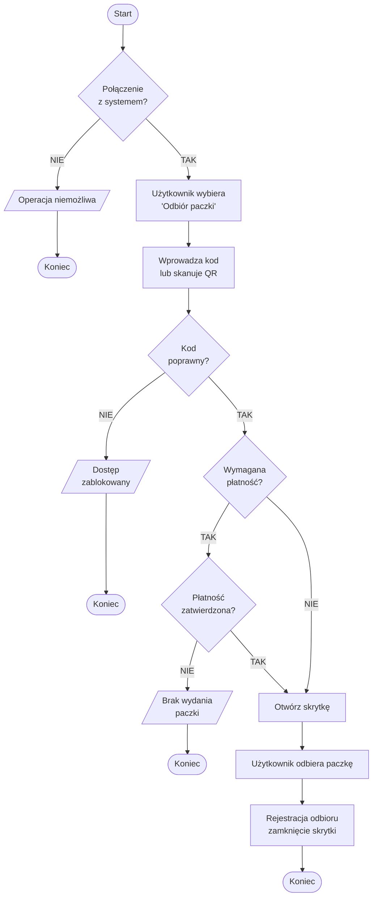

---

### Diagram przepływu (PU1)

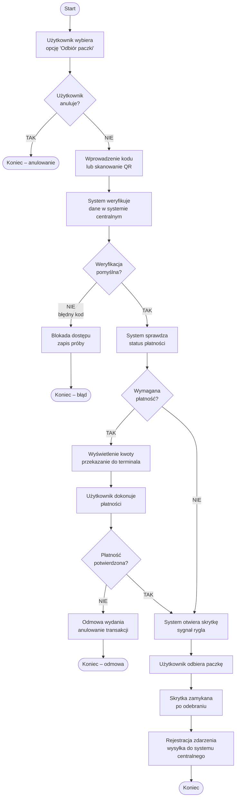

### Diagram stanów (PU1)

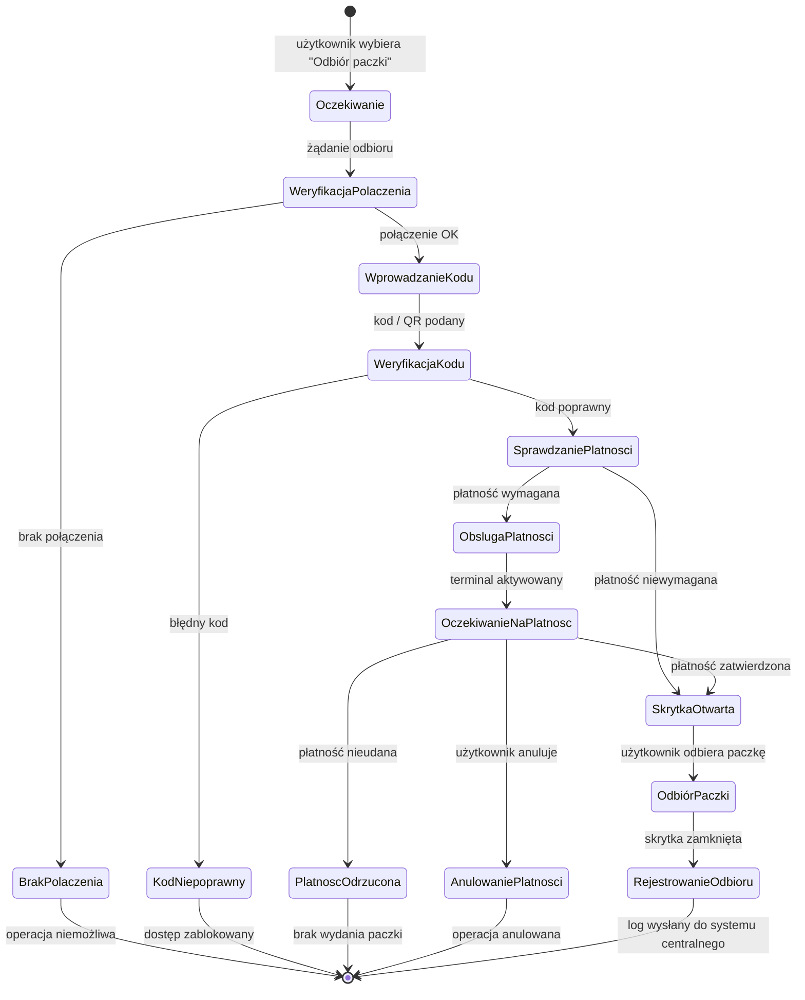

### Diagram sekwencji (PU1)

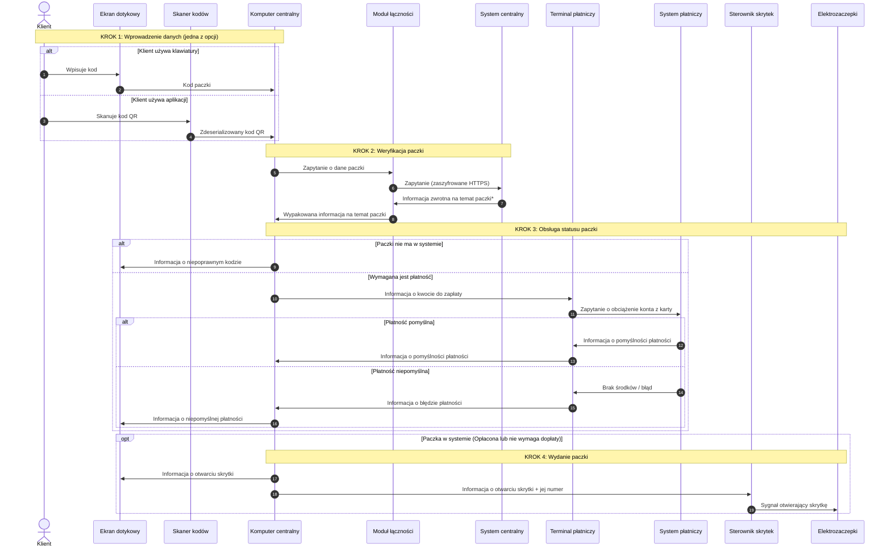

---

## PU2 – Nadanie paczki

### Diagram decyzyjny (PU2)

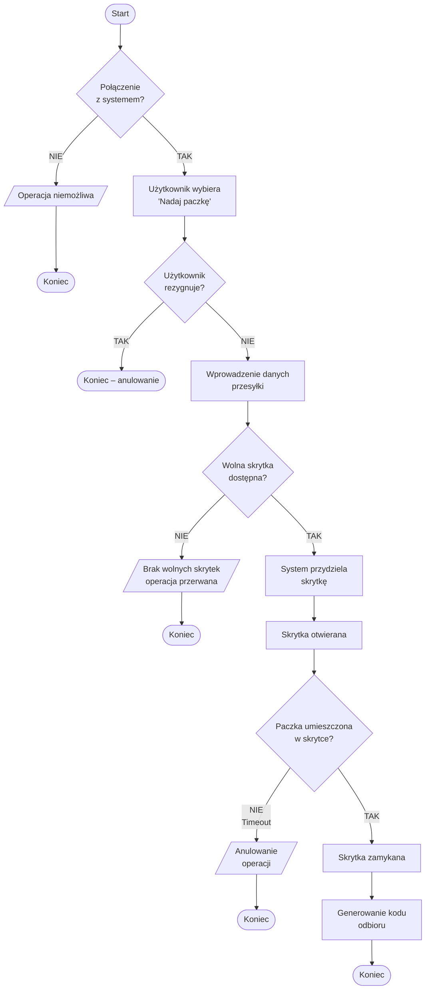

---

### Diagram przepływu (PU2)

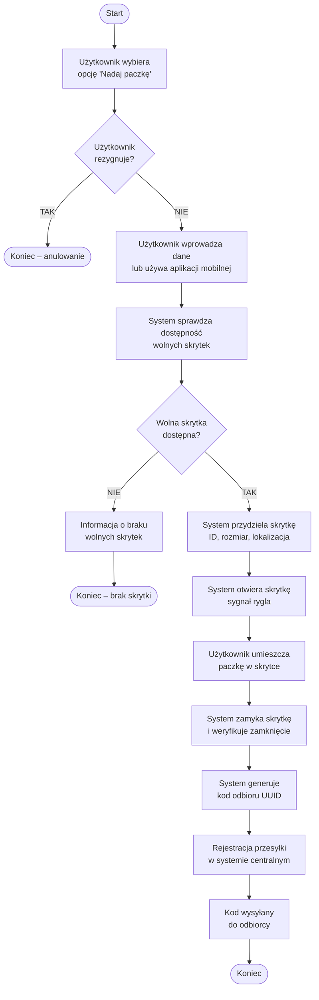

### Diagram stanów (PU2)

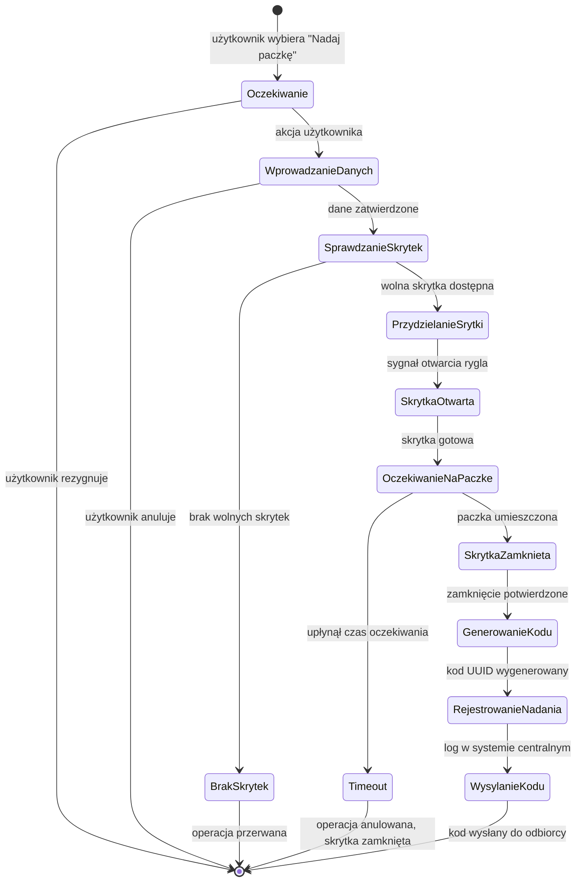

### Diagram sekwencji (PU2)

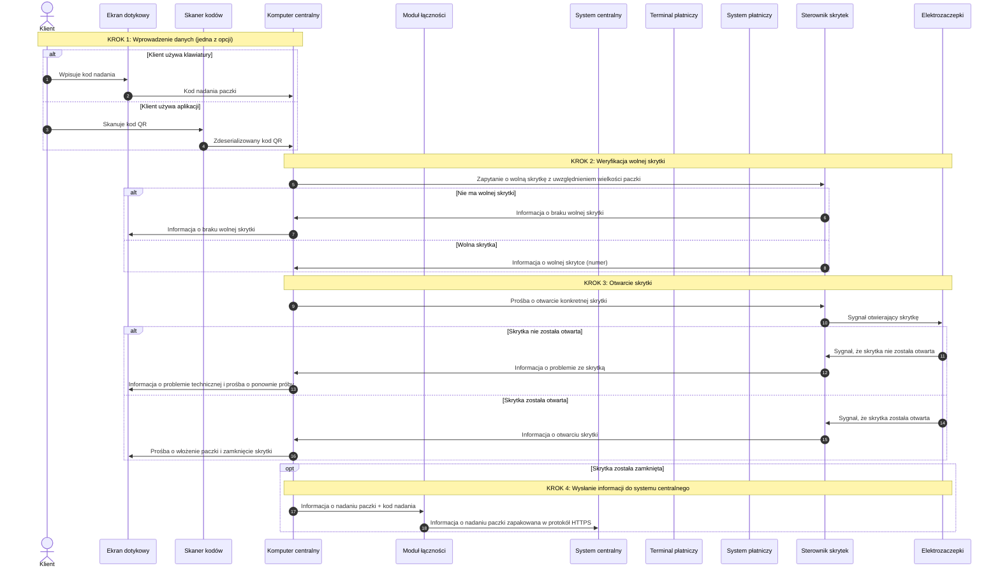

---

## PU3 – Dostarczenie paczki przez kuriera

### Diagram decyzyjny (PU3)

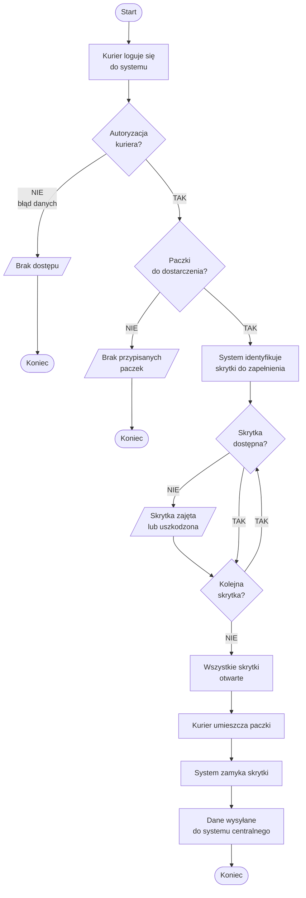

---

### Diagram przepływu (PU3)

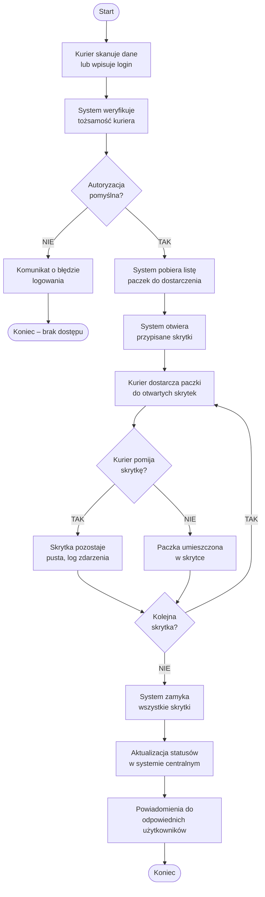

### Diagram stanów (PU3)

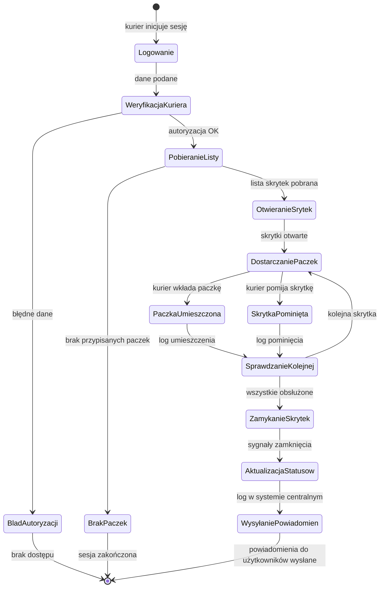

### Diagram sekwencji (PU3)

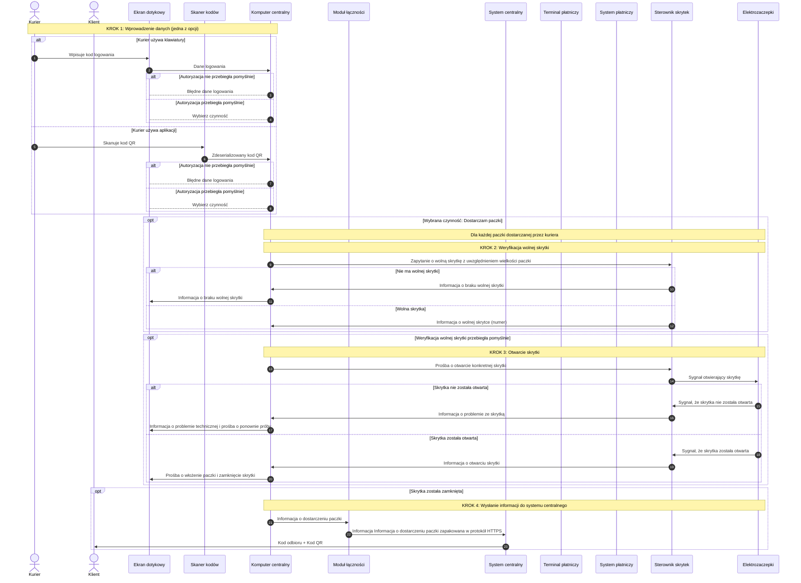

---

## PU4 – Odbiór paczek przez kuriera

### Diagram decyzyjny (PU4)

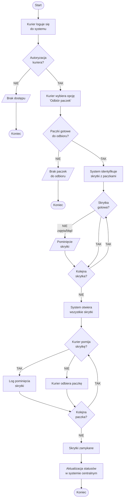

---

### Diagram przepływu (PU4)

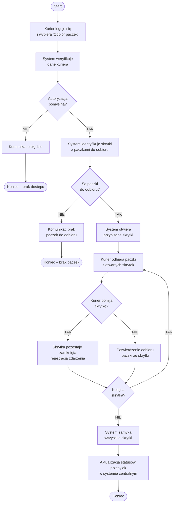

### Diagram stanów (PU4)

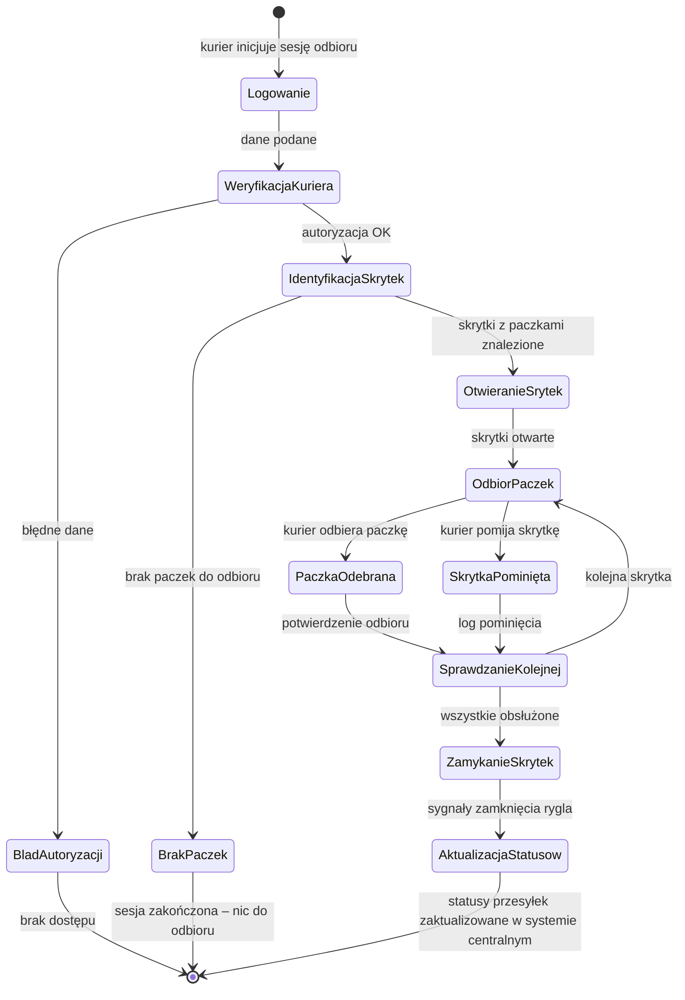

### Diagram sekwencji (PU4)

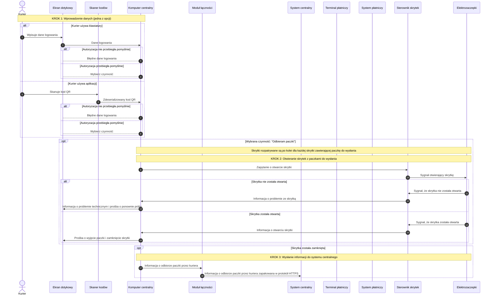

---

## PU5 – Płatność przy odbiorze

### Diagram decyzyjny (PU5)

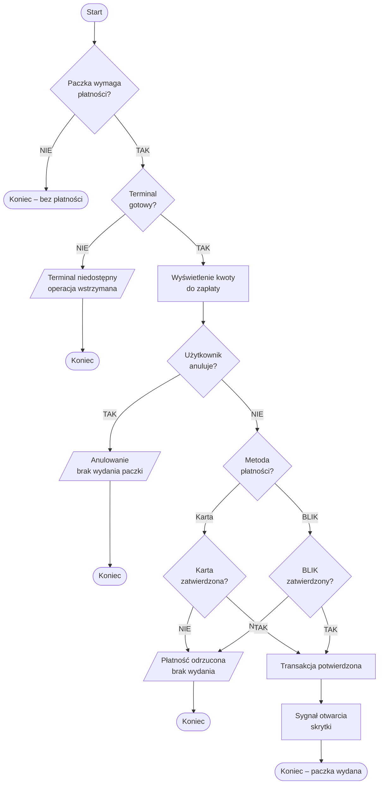

---

### Diagram przepływu (PU5)

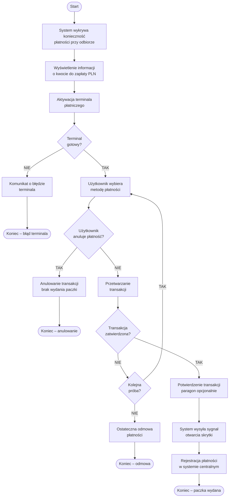

### Diagram stanów (PU5)

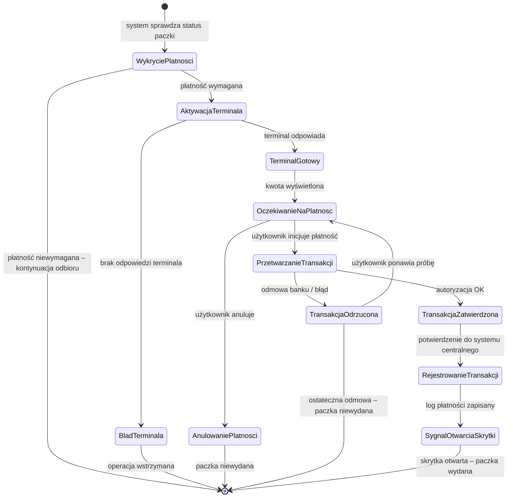
